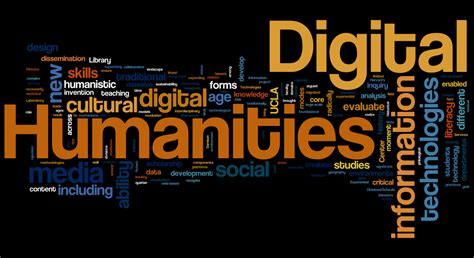

# Digital-Humanities-101

This repository contains my group and individual projects for the Digital Humanities 101 - Practicing the Digital Humanities.

### Individual Project Abstract:
The goal of my individual project is to quantify the influences of temperature and humidity on the transmissibility of COVID-19, through analyzing COVID-19 data from the U.S. COVID-19 data (https://github.com/CSSEGISandData/COVID-19/tree/master/csse_covid_19_data), the global climate data (https://www.nodc.noaa.gov/access/), and the world population data (https://worldpopulationreview.com/countries/) with statistical analysis, data visualization. And I will be using Seaborn, Plotly, Pandas to visualize the trend for the COVID-19 transmission progression, and trying to find the factors that impact the transmission rate of COVID-19, specifically Temperature. I will be trying to answer the below questions: What the relationship between Covid-19 and Temperature be like? can higher Temperatures in the tropical areas help to prevent or slow down the transmission rate?

### Group Project Abstract:
In our group project, we are trying to analyze four articles, which all surrounded on the debut of methodology, interpretation, and scale in digital humanities projects, in order to expose the current challenges in the digital humanities. Liu (The state of the digital humanities A report and a critique, 2011), remains on the traditional side of the digital humanities spectrum. However, Boyde & Crawford (CRITICAL QUESTIONS FOR BIG DATA Provocations for a cultural, technological, and scholarly phenomenon, 2012), Grimmer (We  Are  All  Social  Scientists  Now: How Big Data, Machine Learning, and Causal Inference Work Together, 2015), and Owens (Defining Data for Humanists: Text, Artifact, Information or Evidence, 2011), hope for the possibility of Big Data projects as long as they are merged with humanity’s critical thinking and social awareness. Dr. Nan Z. Da’s article, “The Digital Humanities Debacle” aligns with Liu’s (2011), sentiments as she argues Computational Literary Studies needs to satisfy the evaluative criteria of both Literary Studies and quantitative sciences. Although the Digital Humanities present possibilities for data aggregation, collection, and pattern detection, these endeavors need to be informed and built by the critically aware perspective of humanities scholars to produce research that is accurate and contextualized. Each of us focused on one article first and then trying to find a common theme. 
